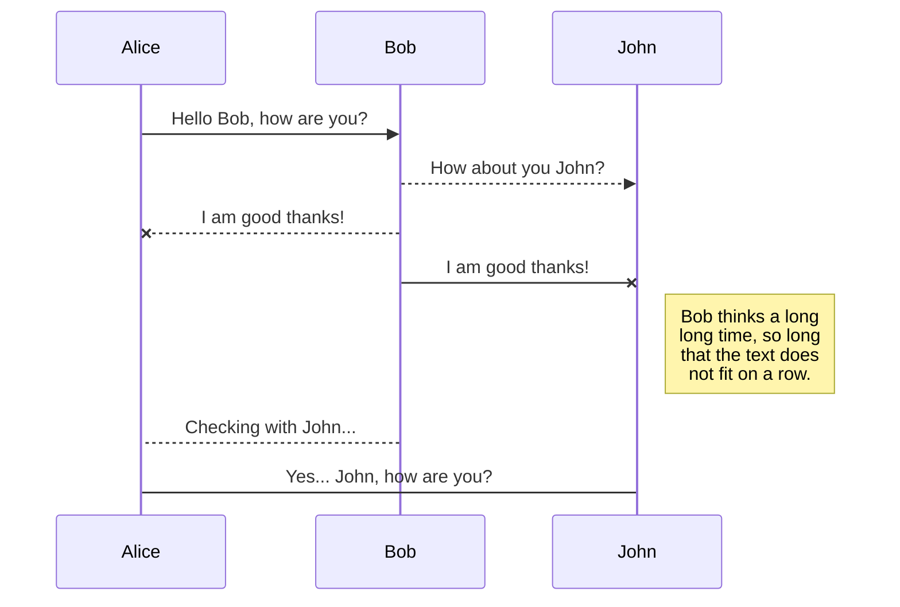
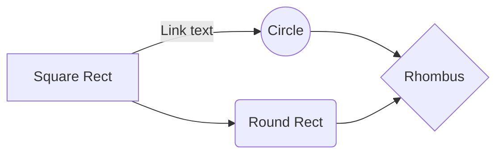

# 법률검색 및 변호사 상담사이트

 기존의 법률 상담 사이트에는 법률 자체를 검색하는 기능이 없으며, 국가 법령정보센터에서 제공하는 법령 정보는 일반인에게는 복잡하고 양이 많음, 따라서 **쉽고 간편한 법률 검색 기능과 상담 기능**을 제공하는 사이트를 만들고자 함.

## 개발환경

-  H/W : Intel호환기중
-  언어 : Java, HTML, CSS, JavaScript, JSP, Oracle SQL
-  O/S : Window
-  DB : Oracle
-  서버 : apache-tomcat-8.5.55
-  IDE : Eclipse (2019-12)
-  라이브러리 : jQuery(3.5.1), BootStrap(4.5.0)
 

## 구현 기능

• 검색 기능 : 메인 화면에 노출 (‘국가법령정보 공동활용 OPEN API’ 활용)

• 상세 검색 페이지 : 법률 카테고리 별 검색

• 상담 페이지

• 변호사 프로필 페이지 & 예약하기 페이지

• 회원서비스 : 가입(의뢰인,변호사 구분) / 정보수정 / 탈퇴 / 의뢰글 작성(의뢰인) / 의뢰글 답변(변호사) / 프로필 작성(변호사) / 예약 시간 설정(변호사) / 예약하기(의뢰인)

• SQL 문을 활용하여 DB 연결

• Session을 이용하여 회원 분류별 권한 조정

• jQuery를 활용한 반응형 웹 구현

## DB 설계

# 담당 역할

• 기능 기획, DB 설계, 변호사 회원 관련 기능 구현, 프로필 게시판 관련 기능 구현

• 프로젝트 주제 선정, 기능 기획 및 조원들과 전체 테이블 설계

## 참여도/기여도

- 변호사 회원 관련 전체 기획, 프론트엔드 및 백엔드 기능구현, 데이터베이스 연동 / 1명 (본인) / 100%

- 의뢰인 회원 기능, 국가법령정보 공동활용 OPEN API 활용, 상담 게시판, 예약 기능 / 6명  / 17%

## 업무내용

변호사 회원의 권한 관련 기능, 프로필 페이지

- 무한 스크롤 방식의 변호사 리스트 노출

- 변호사 회원용 글쓰기 및 수정 기능

- 예약하기 기능과 연동
- 
# 화면 소개

You can open a file from **Google Drive**, **Dropbox** or **GitHub** by opening the **Synchronize** sub-menu and clicking **Open from**. Once opened in the workspace, any modification in the file will be automatically synced.

## 변호사 프로필 리스트
>'변호사 회원'이 자신의 프로필을 작성할 경우, 모든 이용자에게 프로필 리스트가 출력 되는 페이지

**구현기능설명**

• 비회원도 열람 가능한 변호사 프로필 리스트로, '변호사 회원정보'와 '프로필 작성 시 추가로 작성한 사항'들이 노출된다.

• 변호사 이름과 이미지에 마우스를 올리면 색이 변하며, 클릭시 상세 프로필 페이지로 연결

• AJAX를 활용한 비동기 방식으로 최신 프로필 10개만 불러오고, 스크롤을 내리면 연속적으로 10개씩 다음 프로필을 불러오도록 구축

• 프로필 이미지가 없을 시 기본 아이콘이 나타나도록 설정

• 세션에 저장된 회원정보가 변호사 일 경우, 프로필 작성 버튼이 상단에 노출

## 프로필 살세 페이지

> 상세 프로필 페이지

**구현기능설명**

• 프로필 리스트를 통해 이동하는 상세 페이지

• 반응형 웹으로 동작하여 모바일로 접속하여도 모든 기능이 원활 하도록 구축

• 전문 분야는 프로필 작성 시 체크한 항목들을 출력

• 교육 사항 파트는 썸머노트를 활용하여 추가로 이미지를 넣고 글자 크기 등을 편집 할 수 있도록 구성

• 세션 정보를 확인하여 작성한 변호사 회원일 경우만 프로필 삭제, 프로필 수정, 상담시간 설정 기능을 사용하도록 설정

## 프로필 작성 페이지
> 변호사 회원만 접근이 가능한 프로필 작성 페이지

**구현기능설명**

• 프로필 리스트 페이지에서 변호사 회원인 경우 이용할 수 있는 프로필 작성 페이지

• 홍보를 위한 프로필 제목과 전문 분야 체크, 교육 사항과 프로필 사진 등을 업로드 수정 할 수 있는 페이지

• 교육 사항의 경우 summernote 기능을 활용하여 추가로 이미지를 넣거나 글 스타일을 정할 수 있다.

• 프로필 사진의 경우 업로드 하면 리스트페이지와 상세프로필 페이지에 크기가 수정되어 출력된다.

• 수정하기 기능으로 들어온 경우 기존에 작성한 전문분야와 내용들이 출력되어 바로 갱신 할 수 있도록 구축 하였다.

# 참여소감

대학교 졸업 후 처음 하는 팀 프로젝트 이고, 프로젝트 기간에 비해 팀원들이 각자 추가하고자 하는 기능들이 많아 기한을 넘기지 않을까 걱정 했지만, 다행이 기한 내에 원하는 사항들을 모두 만들 수 있었습니다. 시행착오도 물론 있었지만 그 시행착오를 통해 더 많이 배울 수 있었고 다음 프로젝트는 더 효율적으로 진행 할 수 있겠다는 자신감이 생겼습니다.

> Before starting to publish, you must link an account in the **Publish** sub-menu.

## Publish a File

You can publish your file by opening the **Publish** sub-menu and by clicking **Publish to**. For some locations, you can choose between the following formats:

- Markdown: publish the Markdown text on a website that can interpret it (**GitHub** for instance),
- HTML: publish the file converted to HTML via a Handlebars template (on a blog for example).

## Update a publication

After publishing, StackEdit keeps your file linked to that publication which makes it easy for you to re-publish it. Once you have modified your file and you want to update your publication, click on the **Publish now** button in the navigation bar.

> **Note:** The **Publish now** button is disabled if your file has not been published yet.

## Manage file publication

Since one file can be published to multiple locations, you can list and manage publish locations by clicking **File publication** in the **Publish** sub-menu. This allows you to list and remove publication locations that are linked to your file.

# Markdown extensions

StackEdit extends the standard Markdown syntax by adding extra **Markdown extensions**, providing you with some nice features.

> **ProTip:** You can disable any **Markdown extension** in the **File properties** dialog.

## SmartyPants

SmartyPants converts ASCII punctuation characters into "smart" typographic punctuation HTML entities. For example:

|                |ASCII                          |HTML                         |
|----------------|-------------------------------|-----------------------------|
|Single backticks|`'Isn't this fun?'`            |'Isn't this fun?'            |
|Quotes    
   |`"Isn't this fun?"`            |"Isn't this fun?"            |
|Dashes          |`-- is en-dash, --- is em-dash`|-- is en-dash, --- is em-dash|

## KaTeX

You can render LaTeX mathematical expressions using [KaTeX](https://khan.github.io/KaTeX/):

The *Gamma function* satisfying $\Gamma(n) = (n-1)!\quad\forall n\in\mathbb N$ is via the Euler integral

$$
\Gamma(z) = \int_0^\infty t^{z-1}e^{-t}dt\,.
$$

> You can find more information about **LaTeX** mathematical expressions [here](http://meta.math.stackexchange.com/questions/5020/mathjax-basic-tutorial-and-quick-reference).

## UML diagrams

You can render UML diagrams using [Mermaid](https://mermaidjs.github.io/). For example, this will produce a sequence diagram:

And this will produce a flow chart:

<!--stackedit_data:
eyJoaXN0b3J5IjpbMTI5Mjk5MDMzOSwtMjkxMTU3NTM2LDExNj
UzNjkwOTQsMTQxNDI2OTIyNywxNDM1ODQyMjQ5XX0=
-->